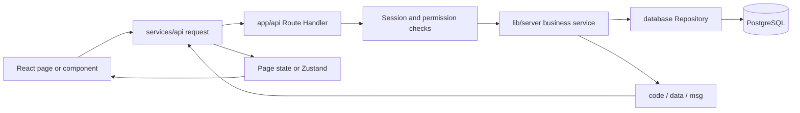
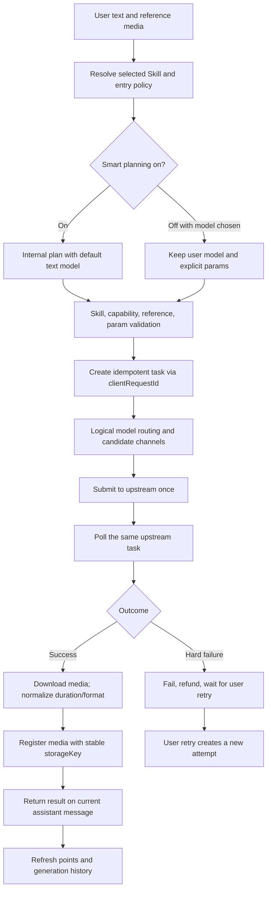
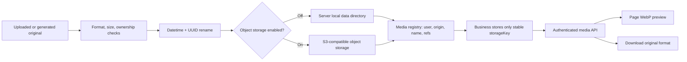
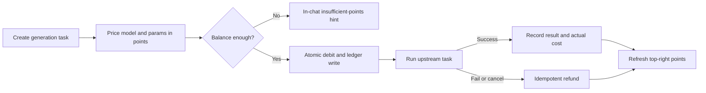
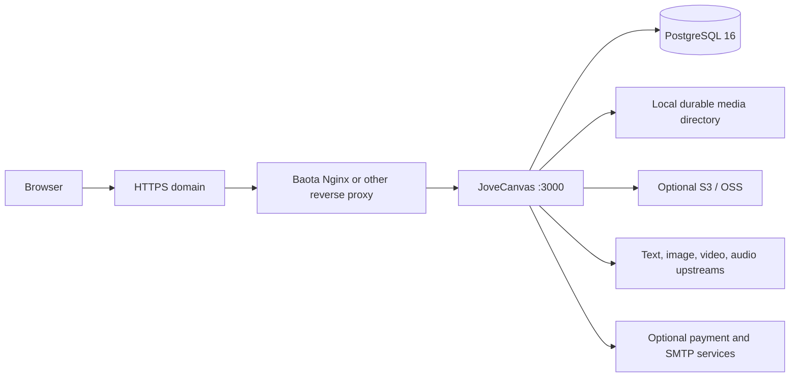
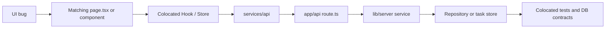

# Project structure & flows

Use this page to answer “where does a feature live, how does a request flow, and where is data stored.” The monorepo is a Next.js full-stack app: the browser owns UI and transient state only. Business rules, secrets, model routing, billing, and persistence stay on the server.

## Repository layout

```text
JoveCanvas/
|- .github/workflows/       Quality checks, app image, and docs image workflows
|- docs/                    Fumadocs documentation site
|  |- content/docs/         Product, deploy, backend, and progress docs
|  |- public/community/     Community assets such as the QQ group QR
|  |- public/screenshots/   Redacted page screenshots used in docs
|  `- src/                  Docs pages, search, and navigation
|- web/                     JoveCanvas main application
|  |- public/               Logo, icons, and other static assets
|  |- scripts/              Standalone start and ops scripts
|  `- src/
|     |- app/               Pages, layouts, and API Route Handlers
|     |- components/        Cross-page components and admin UI
|     |- hooks/             Cross-page interaction and generation hooks
|     |- lib/               Domain contracts, auth, and server business logic
|     |- services/api/      Browser clients for first-party APIs
|     |- stores/            Zustand global transient state
|     `- styles/            Cross-page styles
|- .env.example             Env template without real secrets
|- Dockerfile               Main app standalone production image
|- docker-compose.yml       Standard app + PostgreSQL compose
|- docker-compose.baota.yml Baota PostgreSQL + host-network compose
|- docker-compose.external-db.yml External database compose
|- docker-compose.lowmem.yml      Low-memory compose
|- render.yaml              Render Blueprint
|- AGENTS.md                Engineering constitution (architecture, UI, tests)
|- CONTRIBUTING.md          Issues, PRs, local dev, and quality checks
|- LICENSE / CLA.md         AGPL-3.0 and contributor agreement
|- SECURITY.md              Private vulnerability reporting and supported versions
|- VERSION                  Current release version
`- CHANGELOG.md             Versioned change log
```

`.env`, `.data/`, databases, media data, backups, logs, `.next/`, `node_modules/`, local AI workdirs, and temporary screenshots are not source and must not be pushed to GitHub.

## Web directory responsibilities

| Path | Responsibility |
| --- | --- |
| `web/src/app/(user)/` | Logged-in Agent, image, video, Canvas, short drama, assets, prompts, profile |
| `web/src/app/admin/` | Admin entry, ops console, and install/setup center |
| `web/src/app/api/` | HTTP input, auth, service calls, `{ code, data, msg }` mapping |
| `web/src/components/` | Global layout, shared business components, admin views |
| `web/src/hooks/` | Reused generation, session, copy, download, and sync logic |
| `web/src/services/api/` | Typed browser → Route Handler clients |
| `web/src/stores/` | Shared client state (user, theme, public config, assets) |
| `web/src/lib/*.ts` | Domain contracts for canvas, drama, assets, models, payments, creative runtime |
| `web/src/lib/auth/` | Session, users, permissions, points, public settings |
| `web/src/lib/server/` | Services, task orchestration, providers, billing, media, security |
| `web/src/lib/server/database/` | PostgreSQL schema, parameterized repositories, file provider fallback |
| `web/src/styles/` | Global layout and cross-page theme styles; page-private CSS stays with components |
| `web/src/**/*.test.ts(x)` | Colocated Vitest unit and contract tests |

## Key entry files

| File | What you will see |
| --- | --- |
| `web/src/app/layout.tsx` | Root layout, site metadata, theme, and global providers |
| `web/src/app/(user)/layout.tsx` | Auth, install-state gating, and workspace shell |
| `web/src/app/admin/page.tsx` | Admin entry and top-level business sections |
| `web/src/app/api/**/route.ts` | Param parse, session/admin auth, service call, response mapping |
| `web/src/components/layout/app-workspace-shell.tsx` | User sidebar, top bar, content scroll boundaries |
| `web/src/services/api/request.ts` | Shared response parse and error mapping for browser APIs |
| `web/src/lib/server/agent-run-executor.ts` | Agent Run claim/execute/finalize and failure recording |
| `web/src/lib/server/logical-model-router.ts` | Logical model → channel, upstream model, candidate priority |
| `web/src/lib/server/generation-task-store.ts` | Unified generation task state, concurrency, claim, cancel, stats |
| `web/src/lib/server/object-storage-service.ts` | S3 write, signed read, object management, local media migration |
| `web/src/lib/server/local-media-registry.ts` | Media ownership, origin, original name, storage provider, refs |
| `web/src/lib/server/database/schema.ts` | PostgreSQL tables, indexes, constraints, init structure |
| `web/src/lib/server/database/repositories.ts` | Repository aggregation entry |
| `web/scripts/start-standalone.mjs` | Docker/standalone process start and runtime dirs |
| `web/scripts/reset-admin-password.mjs` | Server-side admin password reset |
| `web/scripts/release-check.mjs` | Version/branding/docs/git-tracked/sensitive-file release checks |
| `.github/workflows/quality.yml` | Web/docs install, typecheck, tests, format, production build |
| `.github/workflows/docker-image.yml` | App amd64/arm64 build, GHCR push, manifest merge |
| `.github/workflows/docs-docker-image.yml` | Docs amd64/arm64 build, GHCR push, manifest merge |

`page.tsx` files are page entries; colocated `use-*.ts(x)`, `*-records.ts`, or `components/` usually hold page-private control logic. Matching server `*.test.ts(x)` files protect tasks, billing, media, database, and protocol boundaries.

## Major service boundaries

| Module | Owns |
| --- | --- |
| `creative-runtime-*` | Creative conversations, messages, stable assets, runs, event persistence |
| `agent-run-*` | Plan validation, skill policy, child task scheduling, events, result write-back |
| `workbench-agent-service.ts` | Image/video workbench planning and manual-model execution entry |
| `logical-model-router.ts` | Logical model → real channel, upstream model, candidate priority |
| `*-task-store.ts` | Text/image/video/audio task state, idempotency, refund boundaries |
| `generation-task-store.ts` | Unified generation state machine, concurrency, task claim |
| `generation-log-*` | User generation history, media results, ops stats |
| `reference-asset-*` | Reference upload, ownership checks, short-lived signed URLs for upstream |
| `local-media-*` | Local media registration, classification, ref protection, read, cleanup |
| `object-storage-*.ts` | S3-compatible config, object access, signing, management, migration |
| `billing-*` / `payment-*` | Products, orders, payments, refunds, reconciliation, points credit |
| `canvas-project-*` | Canvas project validation, save, user isolation |
| `drama-project-*` | Short-drama script, assets, storyboard, versions, cost, render state |

## Standard page request



Route Handlers must not pile business rules or raw SQL. Pages never talk to the database or external model APIs directly; real secrets are decrypted and used server-side only.

## Agent and generation tasks



Platform planning prompts, model-selection rationale, creative briefs, material plans, and visual-review details are internal only—they must not be shown or persisted into generation chat. When the user picks a model and gives an explicit prompt, planning must not re-pick the model, but Skill, capability, reference, billing, and security checks still run.

Polling only queries an already created task. Timeout or “not finished yet” must never create a second upstream job. Only an explicit upstream failure **and** a user retry may start a new attempt, so upstream quota is not double-spent.

## Media storage and access



The external-storage flag only affects where **new** files are written. Historical rows are always read through their own `storage_provider`. Deletion must check creative sessions, asset library, Canvas, short drama, and generation history so references never silently break.

## Points and refunds



## Production deploy



Standard Compose includes PostgreSQL; Baota Compose uses host PostgreSQL; external-DB and low-memory Compose run the app only. All profiles share the same code and data contracts.

## Shortest debugging path



Example: for broken image-task history, start from the image workbench controller → `services/api/image.ts` → `api/image-tasks` → image task store → generation logs and media registry. Do not add database or upstream compatibility branches in the page layer.
